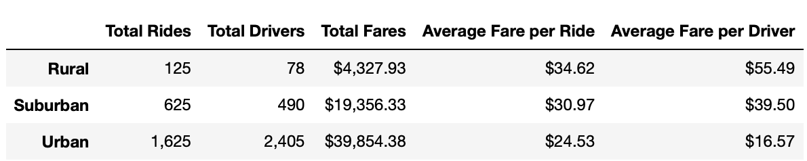

# Pyber Analysis

## Overview
The overview for this analysis was to look at how many rides and how much rides were costing for rural, urban, and suburban areas where the ride company Pyber operated. We took the data that was provided to us and categorized it depending on what we were looking for.

## Results

Looking at the summary data, it shows that Urban areas made the most for total fares at $39,854.38 with the most total rides at 1,625, while also having the lowest average fare per driver at $16.57. Meanwhile rural areas have the lowest total fares ($4,327.93), least total rides (125), and highest fare per driver rate ($55.49). These numbers can be attributed to the fact that Rural areas have a measly 78 drivers compared to Urban areas total of 2,405 drivers.

<analysis>
The fare analysis from before is also reflected in the graph above. While looking at the graph above it seems there is a jump across the board for fares in late Feb leading into March. With this information we could conclude that there are more rides taking place at this time.

## Summary
Going forward there are some business decisions that would be wise for the CEO of Pyber to make. One of them being to allot more drivers to rural areas. A few extra drivers in rural areas would make prices to go down, while having more rides be allowed in this market. Lessen some drivers in Urban areas. Having drivers in the 2,000 range is excessive for the area while the fares are already low as they are. These drivers could easily be allotted to the rural areas that Pyber covers. Have a closer look at when rides are taking place over the year. It may be possible to not always need a constant number of drivers on the streets a year. Surges in rides can take place due to certain events where more drivers would be needed, but having drivers sit while having no rides is not the best decision.

